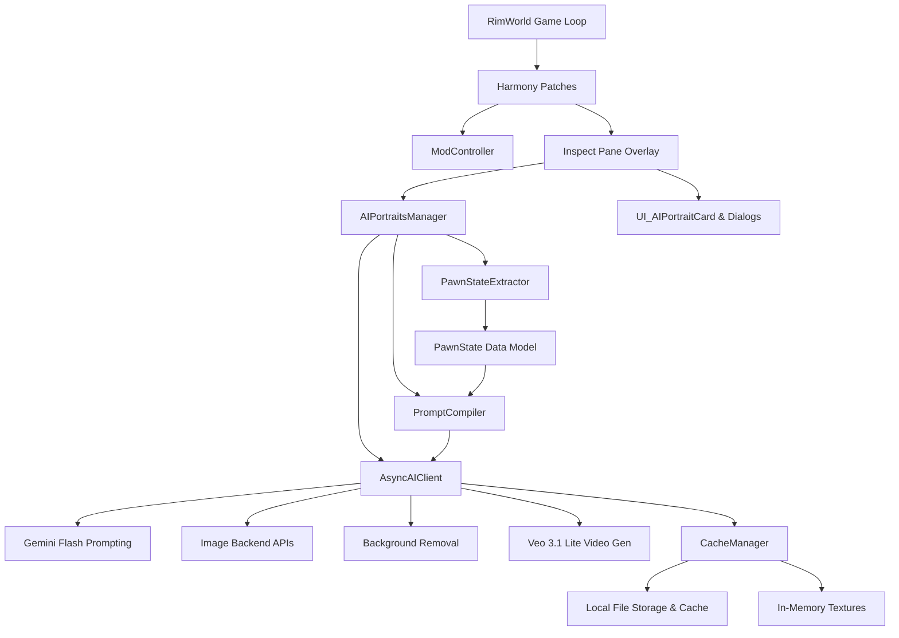

# Developer Architecture Guide — Dynamic AI Portraits

This document provides a detailed technical breakdown of the mod's internal systems, codebase structure, data pipelines, and core algorithms. It is intended for developers who wish to modify, optimize, or audit the mod's logic.

---

## 1. Architectural Diagram

The mod hooks into RimWorld's startup sequence and UI loop, routing pawn metadata extraction, prompt generation, async image generation, post-processing, and caching.



---

## 2. Core Codebase Modules

The mod's source code is organized into modular files within the [Source/](Source) directory:

| Module | Location | Responsibility |
|---|---|---|
| **Bootstrapping** | [ModController.cs](Source/ModController.cs) | The initialization entry point. Extends `Verse.Mod` to load the settings model and applies Harmony patch definitions during startup. |
| **Settings Model** | [ModSettings.cs](Source/ModSettings.cs) | Declares `AIPortraitsSettings` which inherits from `Verse.ModSettings`. Manages serialization of configurations (credentials, styles, offsets, active portrait maps) using RimWorld's `Scribe` framework and defines the Mod Settings UI. |
| **State Extraction** | [PawnStateExtractor.cs](Source/PawnStateExtractor.cs) | Translates live game pawn objects into a serializable [PawnState](Source/PawnStateExtractor.cs#L13-L110) model. Collects physical descriptors, physical and mental health status, bionics, equipment, roles, and backstory. |
| **Prompt Compiler** | [PromptCompiler.cs](Source/PromptCompiler.cs) | Compiles standard structural prompts and formatting rules from extracted pawn states. Contains token guidelines for styles (Korean Webtoon, Rick & Morty Cartoon, 16-bit JRPG Pixel) and configures overrides. |
| **Async Client** | [AsyncAIClient.cs](Source/AsyncAIClient.cs) | Coordinates non-blocking HTTP requests using Unity's `UnityWebRequest` wrapped inside coroutines. Implements interfaces for all 6 backends, handles Gemini Flash Lite prompt expansions, and requests Google Veo 3.1 Lite video generations. |
| **Local BG Removal (primary)** | [U2NetRemover.cs](Source/U2NetRemover.cs) | Offline neural background removal using the **u2netp ONNX model** (via `Microsoft.ML.OnnxRuntime`). Default cutout path for `portrait` / `bodyshot` framings. Transparently falls back to `BackgroundRemover` if the native ONNX runtime or model can't load. |
| **Local BG Removal (legacy fallback)** | [BackgroundRemover.cs](Source/BackgroundRemover.cs) | CPU fallback used only when ONNX is unavailable. Multi-pass perceptual YCbCr flood-fill that extracts transparent overlays from solid background outputs. |
| **Video Matting** | [VideoMatteProcessor.cs](Source/VideoMatteProcessor.cs) | Post-processes generated `.mp4` loops by running u2netp per-frame background removal off the main thread (`special` framing skipped), then reassembling a matted video for transparent playback. |
| **UI Rendering** | [UI_AIPortraitCard.cs](Source/UI_AIPortraitCard.cs) | Implements custom UI windows including the inspect overlay card, the prompt debugging sheet, the saved portrait/video gallery, and the custom video player [VideoPlaybackManager](Source/UI_AIPortraitCard.cs#L954-L1038). |
| **Harmony Hooks** | [HarmonyPatches.cs](Source/HarmonyPatches.cs) | Modifies RimWorld UI, stops video playback on inspect window close, and intercepts apparel render nodes to bypass helmet sprites on active portrait matches. |
| **File Management** | [CacheManager.cs](Source/CacheManager.cs) | Dictates filesystem layout. Saves images and companion text summaries in standard user directories (`Documents/RimWorld Portraits/`) isolated by pawn and world save files. |

---

## 3. Image Generation & Post-Processing Pipeline

The lifecycle of creating, cleaning, caching, and showing a portrait follows this sequence:

```
[User Clicks Refresh / Auto-Trigger]
       │
       ▼
[PawnStateExtractor compiles pawn stats]
       │
       ├─► Generates Reference Sheet (Apparel sprites + native avatar texture)
       │
       ▼
[Is LLM Prompt Enabled?]
       │
       ├──► Yes: Send raw state context to Gemini Flash Lite (returns generated prompt)
       └──► No: Compile template rules from PromptCompiler (returns template style prompt)
       │
       ▼
[AsyncAIClient posts payload to chosen Image Generation backend]
       │
       ▼
[Download & decode raw image bytes into Texture2D]
       │
       ▼
[Run Background Removal — portrait/bodyshot only:
   Cloudflare Bria RMBG (cloud, if enabled) → u2netp ONNX (local) → legacy YCbCr (fallback);
   'special' framing keeps its background]
       │
       ▼
[Save outputs to persistent directories & pin to active pawn slots]
       │
       ▼
[AIPortraitsManager flags local UI cache dirty, triggering redraw]
```

---

## 4. Video Generation Pipeline (Google Veo 3.1 Lite)

When a player toggles video generation for a pawn (switched via the **Pawn Video Toggles**), the mod animates the generated static portrait into a 4-second looping video.

```
[Static Portrait Generated] ──► [QueueVideoGeneration]
                                      │
                                      ▼
[Determine Aspect Ratio: 16:9 for 'special', 9:16 for 'portrait' / 'bodyshot']
                                      │
                                      ▼
[Send POST to generativelanguage.googleapis.com Long-Running Task Endpoint]
                                      │
                                      ▼
[Obtain Operation Name] ──► [Poll Operation Status (every 10s up to 5 min)]
                                      │
               ┌──────────────────────┴──────────────────────┐
               ▼                                             ▼
       [Operation Done]                              [Operation Failed/RAI Filter]
               │                                             │
               ▼                                             ▼
  [Download video .mp4 bytes]                        [Log Redacted Error]
               │
               ▼
  [Save to Cache and User Directories]
               │
               ▼
  [VideoPlaybackManager mounts VideoPlayer & RenderTexture]
```

### A. Request Payload Properties
The API request is sent to:
`https://generativelanguage.googleapis.com/v1beta/models/veo-3.1-lite-generate-preview:predictLongRunning?key={apiKey}`

The JSON request body includes the base64-encoded image bytes and video parameters:
```json
{
  "instances": [
    {
      "prompt": "<pawn_description> + cinematic, masterpiece, character comes alive, breathing, blinking...",
      "image": {
        "bytesBase64Encoded": "<base64_string>",
        "mimeType": "image/png"
      }
    }
  ],
  "parameters": {
    "sampleCount": 1,
    "aspectRatio": "9:16",
    "durationSeconds": 4,
    "resolution": "720p"
  }
}
```

### B. Long-Running Task Polling
Because video generation is asynchronous, the API returns a metadata payload containing an operation `"name"` (e.g., `operations/abc-123`). The mod runs a polling coroutine `PollVeoOperation` at **10-second intervals** for up to **300 seconds** pointing to:
`https://generativelanguage.googleapis.com/v1beta/{operationName}?key={apiKey}`

It parses the status response to verify whether:
1. `done` is true.
2. The `videoUri` is populated.
3. A Responsible AI (RAI) safety filter blocked the generation (parsed from the response's RAI/safety block).

### C. In-Game Playback Engine
The video playback is handled by the [VideoPlaybackManager](Source/UI_AIPortraitCard.cs#L954-L1038) class:
- Instantiates a persistent Unity `GameObject` (`AIPortraits_VideoPlayer_<PawnID>`) marked with `DontDestroyOnLoad`.
- Attaches a `VideoPlayer` component, configures it to loop, and routes the video path (`.mp4`) as its URL source.
- Sets the audio output to `VideoAudioOutputMode.None` to mute any sound effects.
- Creates a `RenderTexture` sized `512x910` (matching the `9:16` vertical format) and links it as the rendering target.
- Blits the `RenderTexture` onto the UI layout overlay during `OnGUI` calls.

---

## 5. Background Removal Implementations

The mod uses a **three-tier** approach to background removal for `portrait` / `bodyshot` framings (the `special` framing always keeps its scenic background). Each tier degrades into the next, so a cutout is always produced even fully offline.

The runtime order (see `AsyncAIClient.DeliverImage` → `DeliverImageLocal`):
1. **Cloudflare Bria RMBG 1.4** (cloud) — only when *Use AI Background Removal* is enabled and a key is set.
2. **u2netp ONNX** (local, offline) — the default path when the cloud remover is off or fails.
3. **Perceptual YCbCr flood-fill** (legacy) — used only if the ONNX runtime/model can't load.

### A. Cloud-Based Pipeline: Cloudflare Bria RMBG Integration
If **AI Background Removal** is enabled in settings and the active pawn framing is `portrait` or `bodyshot`:
1. The mod constructs a `POST` request to Cloudflare's Workers AI endpoint:
   `https://api.cloudflare.com/client/v4/accounts/{account_id}/ai/run/@cf/bria-ai/bria-rmbg-1.4`
2. The raw image is passed as a Base64-encoded string: `{"image": "<base64_data>"}`.
3. The request is authenticated with an authorization header: `Authorization: Bearer <api_token>`.
4. Cloudflare runs the **Bria RMBG v1.4** model (a deep learning matting network) and returns the processed image containing an alpha channel (transparency).
5. If the request fails, the mod logs a sanitized warning and automatically redirects the image into the local C# processing pipeline.

### B. Local Primary Pipeline: u2netp ONNX
The default local remover ([U2NetRemover.cs](Source/U2NetRemover.cs)) runs the **u2netp** salient-object-detection model through ONNX Runtime, entirely offline:
1. The source texture is resized to 320×320 and normalized with ImageNet mean/std into a `1×3×320×320` tensor.
2. `InferenceSession.Run` produces a single-channel saliency mask, which is min–max normalized to `0..1`.
3. The mask is bilinearly upsampled back to the source resolution and written to the alpha channel — alpha is only ever *reduced*, never added, so an already-transparent input is preserved.
4. The native `onnxruntime.dll` is located next to the managed assembly via `SetDllDirectory` + `LoadLibrary`; the `u2netp.onnx` weights resolve from the mod's `Models/` folder. If init or inference throws, the call transparently falls back to the YCbCr remover below.

`ComputeAlpha` touches no Unity objects, so the video matte pipeline ([VideoMatteProcessor.cs](Source/VideoMatteProcessor.cs)) can call it from a background thread to matte `.mp4` frames.

### C. Legacy Fallback Pipeline: Perceptual YCbCr Flood-Fill
The CPU fallback ([BackgroundRemover.cs](Source/BackgroundRemover.cs)) processes images on the CPU in a few milliseconds without using heavy machine-learning libraries, and is used only when ONNX is unavailable.

#### Step 1: Color Space Conversion (YCbCr)
Standard RGB color spaces are poor at representing human visual similarity. The algorithm converts each pixel to **YCbCr** to separate Luma (brightness $Y$) from Chroma (color coordinates $Cb, Cr$):

$$Y = 0.299 \cdot R + 0.587 \cdot G + 0.114 \cdot B$$

$$Cb = -0.168736 \cdot R - 0.331264 \cdot G + 0.5 \cdot B + 128$$

$$Cr = 0.5 \cdot R - 0.418688 \cdot G - 0.081312 \cdot B + 128$$

#### Step 2: Dominant Corner Sampling
It samples pixels from the top-left and top-right corners (occupying 1/8th of the image width and height) to construct a color histogram. The histogram divides colors into 512 discrete color buckets ($8 \times 8 \times 8$).
- It extracts the top 3 peak buckets representing the most common color bins.
- It averages all pixels in those bins to generate up to 3 target background color profiles ($bgColors$).

#### Step 3: Dual-Pass Flood-Fill (BFS)
- **Pass 1 (Strict BFS)**: Seeding along the top-left and top-right margins (excluding the center area where the pawn is located), it spreads outwards. Pixels are added to the queue if their YCbCr distance to any background profile is within strict tolerances:
  - $\text{Chroma Strict Distance} = 5.6$
  - $\text{Luma Strict Distance} = 18.75$
- **Pass 2 (Loose BFS)**: Seeding from the edges of the strict pass, it cleans up border halos using a shallow (1-pixel depth) BFS with relaxed thresholds:
  - $\text{Chroma Loose Distance} = 7.0$
  - $\text{Luma Loose Distance} = 22.5$

#### Step 4: Protection Guards
- **Skin Tone Guard**: If a pixel's coordinates fall inside standard human skin bounds ($Cb \in [95, 126]$ and $Cr \in [130, 165]$), it is **exempt** from removal unless the background itself has a skin-like color. This prevents faces, necks, and ears from getting erased.
- **Vibrant Color Guard**: If a pixel is highly saturated ($|Cb-128| + |Cr-128| > 25$), it is protected from removal if the background profiles are neutral ($|Cb-128| + |Cr-128| \le 20$), preserving colorful hair or armor.
- **Anti-Erosion Guard**: If the algorithm attempts to wipe out $\ge 95\%$ of the image pixels, it aborts the process entirely and returns the source image to avoid invisible pawns.

#### Step 5: Multi-Level Edge Feathering
To prevent pixelated edges, the algorithm runs a distance transform around the cutout border:
- Border pixels directly adjacent to empty pixels (distance 1) have their alpha channels scaled by **40%**.
- Pixels at distance 2 have their alpha channels scaled by **75%**.
This creates a smooth, anti-aliased edge.

---

## 6. PawnState Data Extraction Model

The [PawnState](Source/PawnStateExtractor.cs#L13-L110) model extracts character attributes from live game objects:

1. **Identity & Demographics**: `pawnId`, `name`, `gender`, `bioAge`, `bodyType` (Thin, Female, Male, Hulk, Fat), `headShape`.
2. **Appearance & Aesthetics**: `hairStyle`, `hairColor` (RGB), `skinColor` (RGB), `beardStyle`, `tattooDef`, `furColor` (Biotech fur types).
3. **Genes & Xenotype**: `xenotype` (base def label), `xenotypeName` (player-custom name), `cosmeticGenes` (horns, tails, visual skins), `abilityGenes` (hemogenic, deathrest).
4. **Equipment**: `primaryWeapon` label, `weaponType` (Melee / Ranged / Unarmed), `apparel` list (all worn items), `apparelStyle` (armored, tribal, civilian).
5. **Health & Injuries**: `headInjuries`, `bodyInjuries`, `missingParts`, `implants` (bionics, prosthetics, peg legs), `isSick`, `isInPain`, `painLevel`, `isSleeping`, `isBloodloss`, `isBurning`.
6. **Mind & Mood**: `mentalState`, `moodLevel` (0.0 to 1.0), `isPsychicSensitive`, `isCombatDrafted`, `isFleeing`.
7. **Social & Traits**: `traits` list (e.g. Psychopath, Nudist, Iron-willed), `ideologyName`, `ideologyRole` (Archon, Headliner), `favoriteColor` (RGB tint).
8. **Addictions**: `addictions` (yayo, flake, go-juice, wake-up, smokeleaf, alcohol, psychite).
9. **Royalty & Psylink**: `royalTitle` (Knight, Count), `psylinkLevel` (0 to 6).
10. **Faction & Role Context**: `factionName`, `pawnKind` (Mercenary, Imperial Trooper, Pirate Raider).
11. **Relations**: `hasSpouse`, `hasLover`.
12. **Condition Hashes**: `isExhausted`, `isMalnourished`, `pregnancyTrimester`, `chronicConditions` (cataract, frail, bad back), `permanentScars` (cheek burn, frostbite).

---

## 7. UI Rendering & GC Optimization

In RimWorld, the UI redraws every frame during `OnGUI` loops. Performing allocations inside hot loops causes significant Garbage Collection (GC) churn and frame stutter.

### The Allocation Problem
Previously, searching for a cached portrait texture in the UI overlay used string concatenations:
```csharp
string cacheKey = pawn.ThingID + "|" + framing;
```
This allocation of new string instances every single frame created tens of megabytes of GC pressure per minute.

### Struct-Based Cache Key Resolution
To solve this, the mod uses the [PawnFramingKey](Source/UI_AIPortraitCard.cs#L23) struct as the dictionary lookup key. 
- Structs are allocated on the stack (generating **zero GC memory** on the heap).
- Implements `IEquatable<PawnFramingKey>` to ensure fast, hash-based lookups without boxing.
- Custom `GetHashCode()` matches compiler constraints:
```csharp
public struct PawnFramingKey : IEquatable<PawnFramingKey>
{
    public readonly int pawnId;
    public readonly string framing;

    public PawnFramingKey(int pawnId, string framing)
    {
        this.pawnId = pawnId;
        this.framing = framing;
    }

    public bool Equals(PawnFramingKey other)
    {
        return pawnId == other.pawnId && framing == other.framing;
    }

    public override int GetHashCode()
    {
        return pawnId ^ (framing != null ? framing.GetHashCode() : 0);
    }
}
```

---

## 8. Harmony Patches Hook Architecture

The mod uses [HarmonyPatches.cs](Source/HarmonyPatches.cs) to intercept RimWorld methods:

1. **[Patch_MainTabWindow_Inspect_ExtraOnGUI](Source/HarmonyPatches.cs#L12-L345) (Postfix)**:
   - Hooks into `MainTabWindow_Inspect.ExtraOnGUI` to overlay the character portrait.
   - Restricts drawing to when a single pawn is selected, is not destroyed, belongs to the player faction, and the inspect window has **no open tabs** (Log, Health, Social, etc.).
   - Leaves `36px` clearance above the inspect pane to avoid covering the tab-selection bar.
2. **[Patch_Window_PostClose](Source/HarmonyPatches.cs#L347-L358) (Postfix)**:
   - Detects when the inspect window is closed and signals `VideoPlaybackManager.StopPlayback()` to clean up memory, textures, and video players.
3. **[Patch_PawnRenderNode_Apparel_AppendRequests](Source/HarmonyPatches.cs#L360-L375) (Prefix)**:
   - Intercepts apparel drawing requests on characters when generating reference sheets.
   - If `AsyncAIClient.isGeneratingRefPortrait` is active and the setting `excludeHelmet` is set to `true`, it suppresses headgear drawing requests, allowing the exporter to render a helmet-free native pawn sprite.

---

## 9. Security & Privacy Safeguards

The mod implements several systems to ensure user credentials and local folder structures are never leaked during code sharing, logging, or game streaming:

### Log Sanitization
[AsyncAIClient.SanitizeLog](Source/AsyncAIClient.cs) intercepts all API response and error logs. It runs string replacements on all fields containing user-configured keys (`apiKey`, `cfApiKey`, `giApiKey`, `diApiKey`, `hfApiKey`, `llmApiKey`, `cfBgRemovalKey`).
- It parses combined Cloudflare credentials (`account_id:token`), splitting the values on the colon and redacting both the Account ID and Token separately.
- This prevents credentials from being exposed if a user shares their `Player.log` file while reporting bugs.

### UI Field Masking
In the mod settings page ([ModSettings.cs](Source/ModSettings.cs)), all text fields that input keys use `UnityEngine.GUI.PasswordField('*')` to prevent credentials from being shown on screen, protecting privacy during video streaming or screen sharing.

### Portable Compilations
To keep compilation paths private and prevent Windows username leakage in the repository:
- All developer-specific local paths are moved to a git-ignored [build_local.bat](build_local.bat) file.
- The tracked [build.bat](build.bat) remains generic and reads settings from `build_local.bat` at runtime, keeping local setups private and portable.
